# 🐧 Linux Administration – Real-Time DevOps Use Case

## **Automated Server Setup for New Application (Amazon Linux)**

This README provides a structured roadmap of Linux administration skills needed to automate server setup in a real DevOps environment using **Amazon Linux / Amazon Linux 2**.

---

# 🟩 Level 1 – Basic (Foundational Skills)

## ✔️ 1. Set up Users & Groups for Development Team

```bash

sudo adduser devuser # Create user
sudo groupadd devteam # Create group
sudo usermod -aG devteam devuser # Add user to group
```
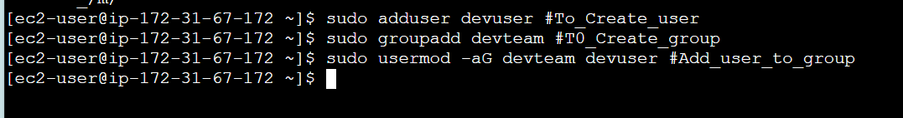

### Verify:

```bash
id devuser
grep devteam /etc/group
```

---

## ✔️ 2. Manage Permissions for Project Directories

```bash
sudo mkdir -p /var/www/project
sudo chown -R devuser:devteam /var/www/project
sudo chmod -R 770 /var/www/project
```
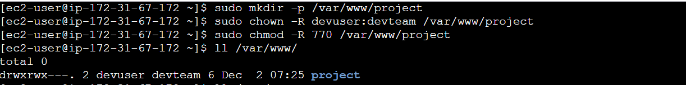

---

## ✔️ 3. Install Required Packages (Amazon Linux)

### **Amazon Linux 2 Package Installation**

```bash
sudo yum install -y git nginx java-1.8.0-openjdk
```
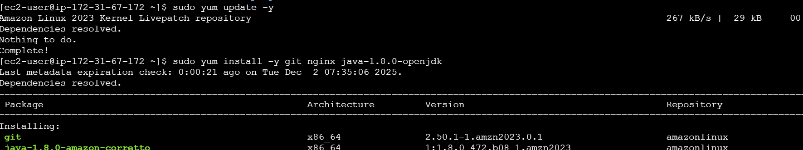

Enable & start Nginx:

```bash
sudo systemctl enable nginx
sudo systemctl start nginx
sudo systemctl status nginx
```


---

## ✔️ 4. Check System Information


```bash
free -h     ### Memory
```
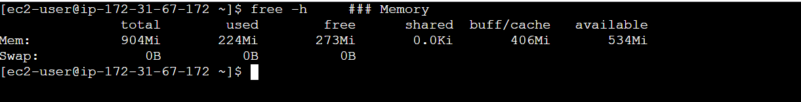

```bash
lscpu       ### CPU
```


```bash
df -h       ### Disk
```


```bash
systemctl list-units --type=service ### Running services
```


---

# 🟨 Level 2 – Intermediate (Daily DevOps Tasks)

## ✔️ 1. Automate Backups Using Cron

### Edit Cron:

```bash
crontab -e
```

```
0 2 * * * tar -czf /backup/app-$(date +\%F).tar.gz /var/www/project   ### Daily backup at 2 AM:
```
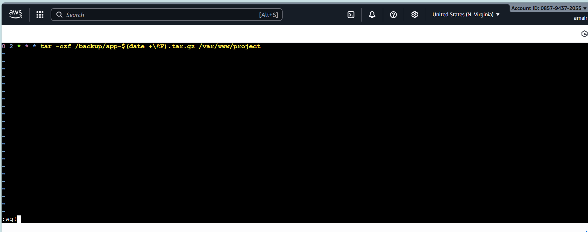


---

## ✔️ 2. Create Shell Scripts

### **Log Cleanup Script**

`/scripts/cleanup_logs.sh`

```bash
#!/bin/bash
find /var/log -type f -name "*.log" -mtime +7 -exec rm {} \;
```

Make executable:

```bash
chmod +x /scripts/cleanup_logs.sh
```

---
```

---

## ✔️ 3. Manage Logs Under `/var/log`

```bash
cd /var/log
sudo tail -f dnf.log
sudo tail -50 /var/log/nginx/error.log
sudo journalctl -u nginx
```
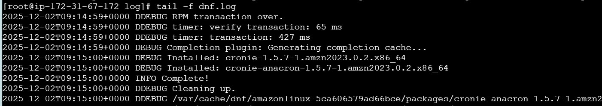

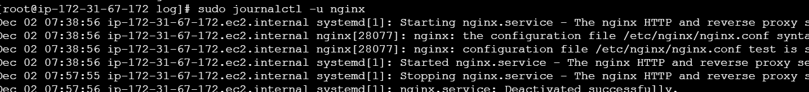

---

## ✔️ 4. Monitor System Performance

### CPU/Memory Usage

```bash
top
htop     # install: sudo yum install -y htop
```
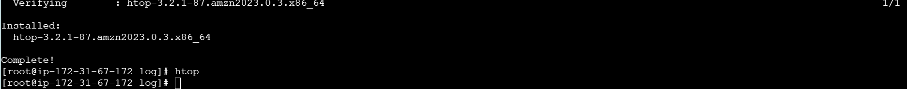

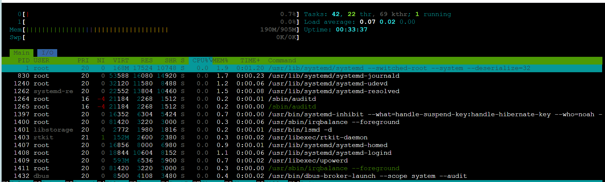

### Check Running Services

```bash
systemctl status nginx
```
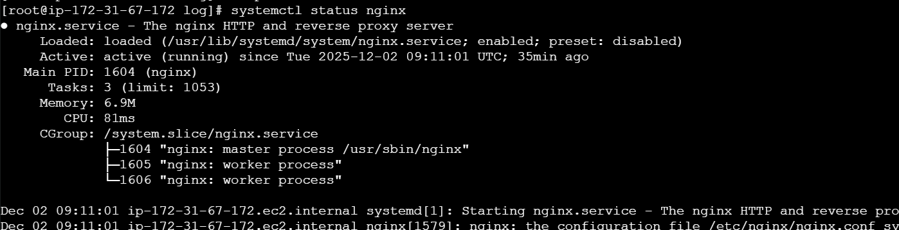


### Network Stats

```bash
ss -tulpn
```
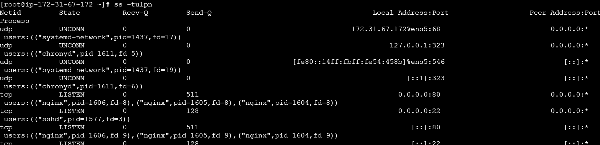

---

# 🟥 Level 3 – Advanced (Production Linux Admin)

## ✔️ 1. Create Custom **systemd Service** for Your Application

### Create service file:

`/etc/systemd/system/myapp.service`

```ini
[Unit]
Description=My Custom Application
After=network.target

[Service]
User=devuser
WorkingDirectory=/var/www/project
ExecStart=/usr/bin/java -jar app.jar
Restart=always

[Install]
WantedBy=multi-user.target
```
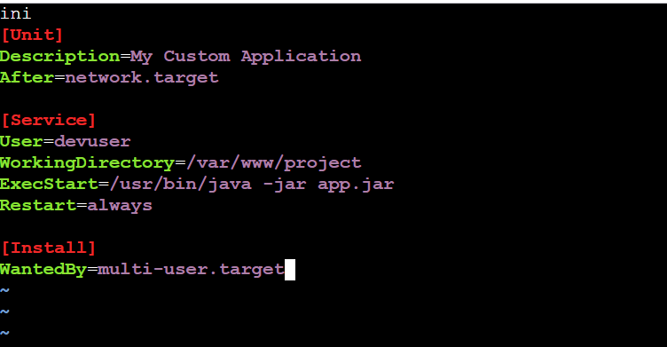

### Enable & Start:

```bash
sudo systemctl daemon-reload
sudo systemctl enable myapp
sudo systemctl start myapp
sudo systemctl status myapp
```
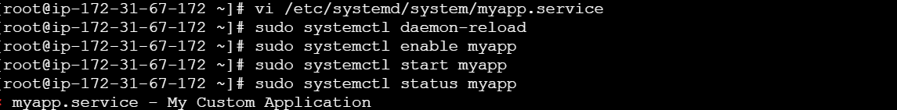

---

## ✔️ 2. SSH Hardening (Amazon Linux)

Edit ssh config:

```bash
sudo vi /etc/ssh/sshd_config
```

Recommended changes:

```
PermitRootLogin no
PasswordAuthentication no
AllowUsers devuser
```
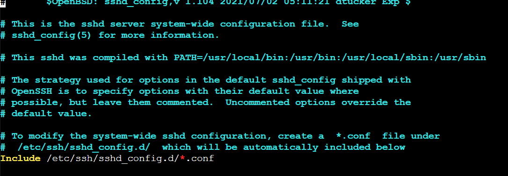

Restart SSH:

```bash
sudo systemctl restart sshd
```


---

## ✔️ 3. LVM Setup for Storage Scaling

```bash
sudo pvcreate /dev/nvme1n1
sudo vgcreate app_vg /dev/nvme1n1
sudo lvcreate -n app_lv -L 10G app_vg
sudo mkfs.ext4 /dev/app_vg/app_lv
sudo mkdir /mnt/appdata
sudo mount /dev/app_vg/app_lv /mnt/appdata
```


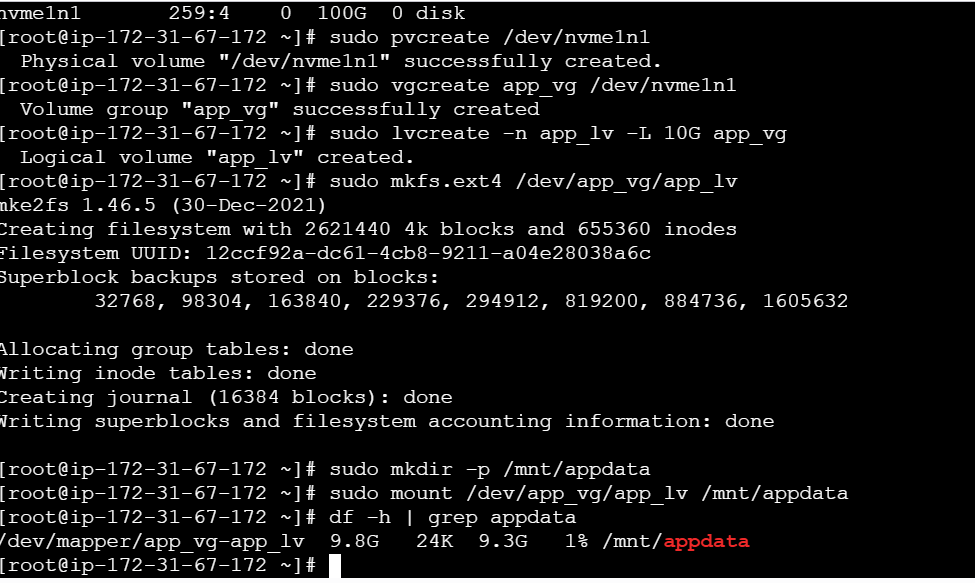

---

## ✔️ 4. Configure Firewall Rules (Amazon Linux uses firewalld)

Install:

```bash
sudo yum install -y firewalld
sudo systemctl enable --now firewalld
```
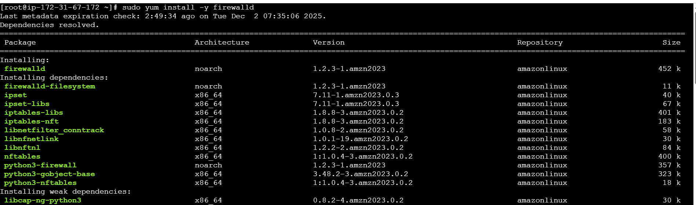


Allow ports:

```bash
sudo firewall-cmd --permanent --add-service=http
sudo firewall-cmd --permanent --add-service=https
sudo firewall-cmd --reload
```
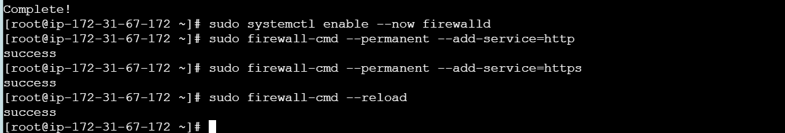

---

## ✔️ 5. Implement Logrotate for Application Logs

Create config:
`/etc/logrotate.d/myapp`

```bash
/var/www/project/logs/*.log {
    daily
    rotate 7
    compress
    missingok
    notifempty
}
```
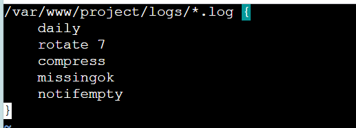

Test:

```bash
sudo logrotate -d /etc/logrotate.d/myapp
```

---

